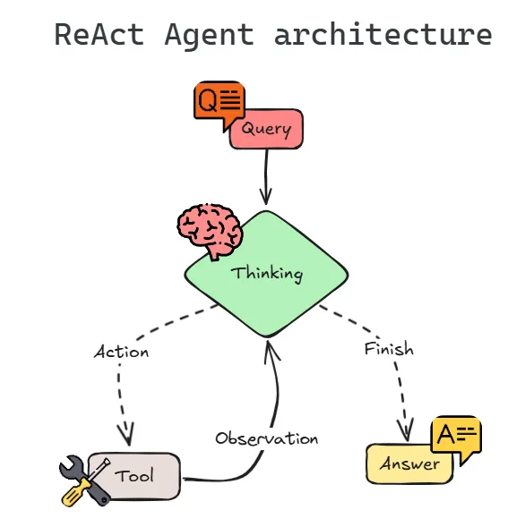

# Autonomous AI Agent

## Overview

This project implements an AI agent capable of planning and executing tasks using external tools.

## What we are building
AI Agent = LLM + Memory + Tools + Decision Loop

## Features

* Web search tool
* Calculator tool
* Task reasoning

## Architecture

User → Agent → Tool Selection → Tool Execution → Response

## Architecture Flow
User Query
   ↓
LLM (Reasoning)
   ↓
Select Tool (Search / DB / API)
   ↓
Execute Tool
   ↓
Observe Result
   ↓
Repeat (loop)
   ↓
Final Answer

## Tech Stack

* Python
* LangChain
* OpenAI / Claude

## Use Cases

* Research automation
* Report generation
* Task execution agents

## Future Enhancements

* Multi-step planning
* Memory integration
* UI dashboard
